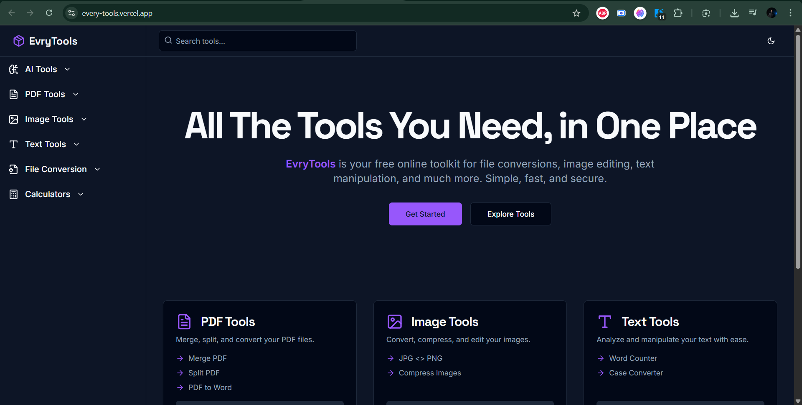
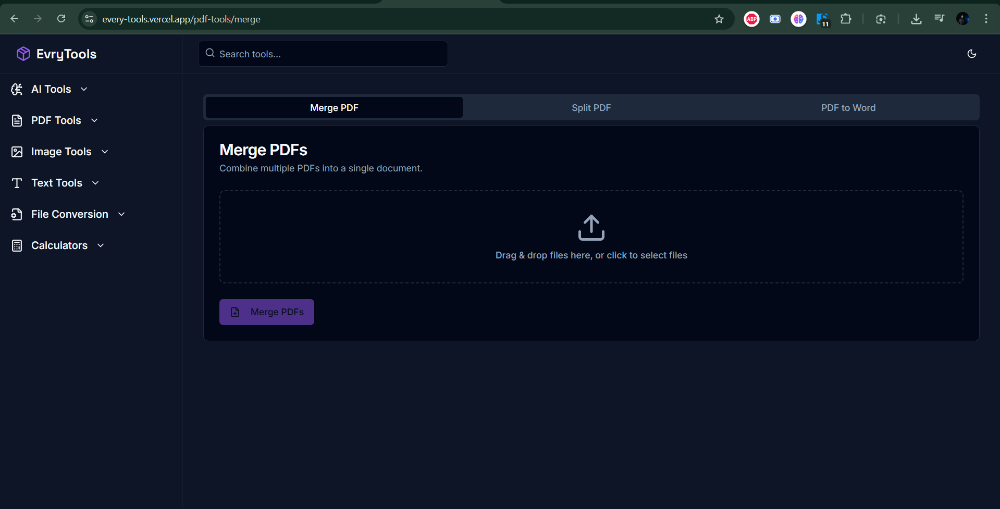

# EveryTools – Free Online Toolkit for Everyday Tasks

Welcome to **EveryTools**! A powerful and free online toolbox designed to handle all your daily digital needs—from PDF merging to image conversion to text editing and beyond.

**Live Site:** [every-tools.vercel.app](https://every-tools.vercel.app) :contentReference[oaicite:1]{index=1}

---

##  ​ Features

- Merge, split, and compress PDFs  
- Convert between popular image formats  
- Text utilities like word count and case conversion  
- Useful calculators and productivity tools  
- Light and dark theme support  
- Clean, responsive UI powered by Next.js and Tailwind CSS

---

##  ​ Tech Stack

- **Framework**: Next.js (App Router)  
- **Styling**: Tailwind CSS  
- UI Components: `shadcn/ui` (Toaster, ThemeProvider, Sidebar, Header, etc.)  
- **Hosting**: Vercel (Live site shown above)
- **GEMINI**:gemini key required

---

##  Setup & Installation

1. **Clone the repo**
    ```bash
    git clone https://github.com/harshugarg2907/EveryTools.git
    cd EveryTools
    ```

2. **Install dependencies**
    ```bash
    npm install
    ```

3. **Run the development server**
    ```bash
    npm run dev
    ```
    Visit [http://localhost:3000](http://localhost:3000) to preview.

---

##  Deployment

Your project is seamlessly deployed via **Vercel**, offering automatic builds and global CDN performance.

---

##  Screenshots




---

##  Contributing

Contributions are welcome! Feel free to:
- Fork the repository
- Create feature branches
- Submit pull requests with enhancements or bug fixes

Please adhere to standard commit message conventions and code styling.

---

##  Future Roadmap

Potential future improvements:
- Add user authentication for saving tool history
- Introduce more file/format support (e.g. audio/video tools)
- Add internationalization for multilingual support

---

##  Contact

Have ideas or feedback? Reach out or open an issue—we'd love to hear from you.
